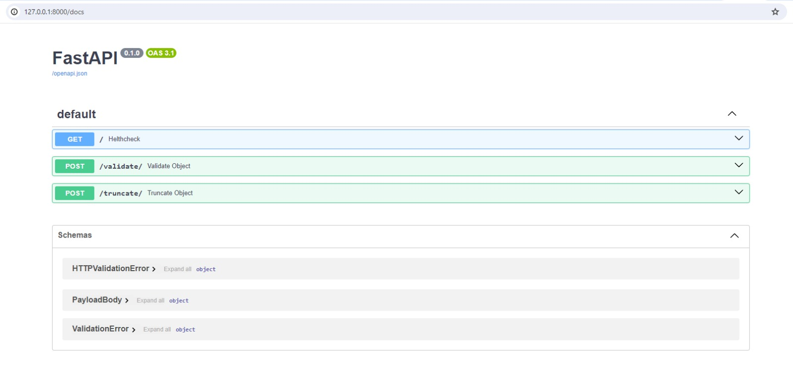

# FastAPI Application

## Overview

We moved app.py to src folder so it is easier for local development:
we don't need to watch for changes in venv folder but we wanna have reload on changes.

## Local Development

- Install Python (tested with version 3.12.1)

- Create a virtual environment:
python -m venv venv

- Activate the virtual environment:
.\venv\Scripts\activate

- Update python installer:
python -m pip install --upgrade pip

- Install dependencies:
pip install -r requirements-local-dev-windows.txt

- Running the Application:
uvicorn src.app:app --reload --reload-dir src

- Accessing the Endpoints Manually (UI):
Testing endpoints on http://127.0.0.1:8000/docs

- Run with Debug Locally in VScode:
{
    "version": "0.2.0",
    "configurations": [
        {
            "name": "Python: Uvicorn",
            "type": "python",
            "request": "launch",
            "module": "uvicorn",
            "args": [
                "src.app:app",
                "--reload",
                "--reload-dir",
                "src"
            ],
            "console": "integratedTerminal",
            "env": {
                "PYTHONPATH": "${workspaceFolder}/src"
            },
            "jinja": true
        }
    ]
}

## Heroku Deployment
Dev, staging and prod is on Linux based Heroku servers, so requirements.txt is super simple
Run command and runtime requirements are in Procfile and runtime.txt

## Tests
- python test_validate.py
- python test_truncate.py
